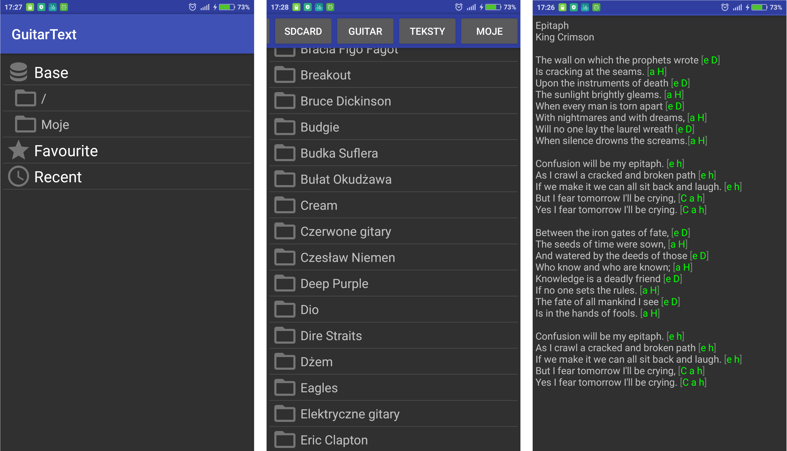

# GuitarText
GuitarText is simple Android app which shows lyrics of songs with highlighted guitar chords.
GuitarText also allows transposing the chords.
Application is in a design phase, so if you have any idea how it may work, fill free to create new issue.

Used technologies and concepts:
 - MVP pattern 
 - Dagger 2
 - Butter Knife
 - OrmLite
 - Guava

## TODO

 1. ~~Allow to add file or dir to _Base_ category by long click.~~
 2. Auto management of _Favourite_ (add, sort).
 3. Management of last _Recent_.
 4. ~~Sort files and directories.~~
 5. ~~Use appropriate icons on category screen.~~
 6. Go previous visited directory by clicking back button.
 7. ~~Integration of PathView with AppBar.~~
 8. Smaller buttons on PathView.
 9. ~~Chords shifting.~~
 10. Save user preference to local db via some ORM.
 11. Lyrics auto scroll.
 12. Add options to show hidden files.
 13. Lyrics on fullscreen.
 14. Allow to remove files from category.
 15. Project description and screenshots.
 16. ~~Add app icon.~~